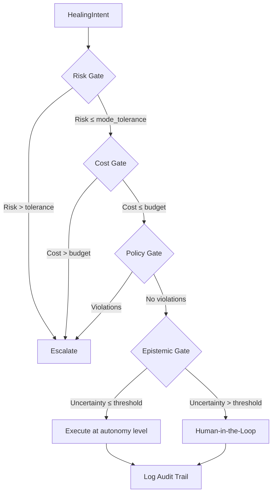

# Enterprise & Startup Deployment

ARF scales from startups to global enterprises. This section describes the features, architecture, and deployment models available in the **Enterprise** edition.

---

## Enterprise Features Overview

| Feature | Description |
|---------|-------------|
| **Execution Ladder** | Tree‑of‑thought reasoning with gate‑based validation (risk, cost, policy, epistemic). Determines autonomy level. |
| **Audit Trails** | Immutable, queryable logs of all decisions and executions. |
| **Enforcement** | Automatic rollback, blast radius limits, and circuit breakers. |
| **Multi‑tenancy** | Isolated workspaces with RBAC. |
| **Compliance** | SOC2, ISO 27001 reporting, data retention policies. |
| **Advanced Risk Fusion** | Full hyperprior + HMC with real‑time model updates. |
| **Semantic Memory** | FAISS vector search with sentence‑transformers for context‑aware retrieval. |
| **Observability** | Prometheus metrics, Grafana dashboards, OpenTelemetry tracing. |

---

## Execution Ladder (Tree‑of‑Thought Reasoning)

The **execution ladder** is a Rust‑based engine that evaluates a `HealingIntent` through a sequence of gates. It determines whether an action can be executed autonomously and at what level.



Each gate returns a boolean and a reason. The overall result is an object with:

```json
{
  "allowed": true,
  "level": "LowRisk",
  "reason": "All gates passed",
  "gates_passed": ["risk", "cost", "policy", "epistemic"],
  "gates_failed": [],
  "tree_path": ["risk_gate", "cost_gate", ...]
}
```

### Autonomy Levels

| Level | Description |
|-------|-------------|
| `Advisory` | Recommendation only; execution requires human approval. |
| `LowRisk` | Automated execution with monitoring. |
| `MediumRisk` | Automated with alerting. |
| `HighRisk` | Requires human‑in‑the‑loop review. |

Audit Trail
-----------

All decisions and executions are persisted in a SQLite (or PostgreSQL) database with full traceability.

```python
class AuditLogger:
    def log_decision(decision: Dict[str, Any]) -> None
    def log_execution(execution: Dict[str, Any]) -> None
    def get_decision(decision_id: str) -> Optional[Dict[str, Any]]
    def get_executions_for_decision(decision_id: str) -> List[Dict[str, Any]]
```

Each entry includes:

*   id (UUID)
    
*   timestamp
    
*   action (APPROVE/DENY/ESCALATE)
    
*   component
    
*   risk\_score
    
*   outcome
    
*   details (JSON with explanation, epistemic breakdown, etc.)
    

Deployment Architectures
------------------------

### Startup Mode

*   **Frontend**: Vercel (Next.js)
    
*   **Backend**: FastAPI (single instance)
    
*   **Database**: PostgreSQL
    
*   **Vector Store**: FAISS in‑memory
    
*   **Model**: Pre‑trained HMC JSON
    

### Enterprise Mode

*   **Frontend**: Vercel + custom dashboard
    
*   **Backend**: FastAPI, horizontally scaled
    
*   **Database**: PostgreSQL (RDS) with read replicas
    
*   **Vector Store**: FAISS with persistence (S3)
    
*   **Model Training**: Scheduled retraining workers
    
*   **Observability**: Prometheus, Grafana, OpenTelemetry
    
*   **Logging**: Centralised logging (ELK)
    

Integration with OSS
--------------------

The Enterprise edition extends the OSS core by providing:

*   **Execution enforcement** (wrapping the OSS HealingIntent with the Rust ladder)
    
*   **Persistent audit** (beyond the OSS SQLite mock)
    
*   **Advanced memory** (sentence‑transformers, FAISS)
    
*   **Real‑time HMC updates** (online training of the logistic regression)
    

The OSS engine remains the canonical source of advisory decisions; Enterprise adds the execution layer.

Related Code
------------

*   Execution Ladder: [src/arf\_enterprise/execution\_ladder.py](https://github.com/arf-foundation/enterprise/blob/main/src/arf_enterprise/execution_ladder.py)
    
*   Audit Logger: [src/arf\_enterprise/audit.py](https://github.com/arf-foundation/enterprise/blob/main/src/arf_enterprise/audit.py)
    
*   Configuration: [src/arf\_enterprise/config.py](https://github.com/arf-foundation/enterprise/blob/main/src/arf_enterprise/config.py)
    

Recommendations for Enterprise Deployments
------------------------------------------

*   **Separate inference from training** – run HMC retraining on a schedule, not inline.
    
*   **Use rate limiting** – protect APIs from abuse.
    
*   **Maintain incident review processes** – periodically audit escalation decisions.
    
*   **Enable telemetry** – Prometheus metrics for all gates and decisions.
