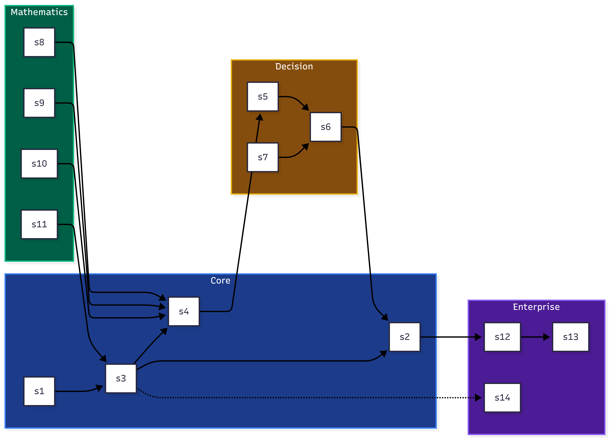

# Glossary of Terms

This page defines the core concepts, components, and mathematical terms used throughout the ARF Specification. The diagram below shows how key entities relate to each other.

## Concept Map

## Definitions

| Term | Definition | Category | See also |
|------|------------|----------|----------|
| **InfrastructureIntent** | Abstract base class for any infrastructure request (provision, grant access, deploy config). It contains service name, environment, requester, and provenance metadata. | Core | [`core_concepts.md`](core_concepts.md) |
| **HealingIntent** | Immutable container for a governance recommendation. Contains action (approve/deny/escalate), risk score, justification, confidence, and full decision trace. | Core | [`governance.md`](governance.md) |
| **RiskScore** | Bayesian posterior mean (0–1) computed by the `RiskEngine`. Blends conjugate prior, HMC prediction, and optional hyperprior. | Mathematics | [`mathematics.md`](mathematics.md) |
| **GovernanceLoop** | Orchestrator that processes an `InfrastructureIntent` and returns a `HealingIntent`. Integrates cost, policy, risk, epistemic uncertainty, predictive foresight, and memory. | Core | [`governance.md`](governance.md) |
| **RecommendedAction** | Enum: `APPROVE`, `DENY`, `ESCALATE`, `DEFER`. Determined by expected loss minimisation, overridden by policy violations or high epistemic uncertainty. | Decision | [`governance.md`](governance.md) |
| **Expected Loss Minimisation** | Decision rule that selects the action with smallest expected loss, using cost constants (`COST_FP`, `COST_FN`, etc.) and optional CVaR for tail risk. | Decision | [`governance.md`](governance.md) |
| **Escalation Gates** | Mechanical validations in the enterprise layer: license, confidence, risk, rollback, causal. All required gates must pass for execution. | Enterprise | [`enterprise.md`](enterprise.md) |
| **Execution Ladder** | Hierarchy of autonomy levels: Advisory → Operator Review → Supervised → Autonomous (Low) → Autonomous (High) → Novel Execution. Enforced by enterprise gates. | Enterprise | [`enterprise.md`](enterprise.md) |
| **Conjugate Beta** | Online Bayesian model with Beta priors per action category. Posterior parameters `(α,β)` updated after each outcome. Provides fast, interpretable risk updates. | Mathematics | [`mathematics.md`](mathematics.md) |
| **HMC Logistic Regression** | Offline Hamiltonian Monte Carlo (NUTS) model that captures complex patterns (time of day, user role, environment) from historical data. | Mathematics | [`mathematics.md`](mathematics.md) |
| **Hyperprior Shrinkage** | Hierarchical Beta model (`α₀,β₀ ∼ Gamma(2,1)`) that shares statistical strength across categories. Fit via SVI in Pyro. | Mathematics | [`mathematics.md`](mathematics.md) |
| **Epistemic Uncertainty** | Composite score `ψ = 1 - (1‑hallucination)(1‑forecast_uncertainty)(1‑data_sparsity)`. When `ψ > threshold`, forces escalation. | Decision | [`governance.md`](governance.md) |
| **Lyapunov Stability** | Discrete‑time stability guarantee for healing actions. Quadratic Lyapunov function `V(x,r)` decreases along trajectories if a stabilising action exists. | Mathematics | [`mathematics.md`](mathematics.md) |
| **Temporal Reliability** | Optional external layer for cross‑session reliability aggregation. Uses `session_id`, `observed_at`, time windows, decay. Does not affect in‑session scoring. | Extension | [`temporal_reliability.md`](temporal_reliability.md) |
| **RAGGraphMemory** | Semantic memory using FAISS index (IndexFlatL2 in OSS) to retrieve similar past incidents. Enhances confidence via similarity‑weighted boosting. | Core | [`design.md`](design.md) |
| **CVaR** | Conditional Value at Risk. When enabled (`USE_CVAR=true`), approve loss uses average of worst `α=0.05` fraction of loss samples – penalises tail risk. | Decision | [`constants.py`](https://github.com/arf-foundation/agentic_reliability_framework/blob/main/agentic_reliability_framework/core/config/constants.py) |
| **IntentSource** | Enum indicating origin of a `HealingIntent`: `OSS_ANALYSIS`, `HUMAN_OVERRIDE`, `RAG_SIMILARITY`, `INFRASTRUCTURE_ANALYSIS`, etc. | Core | [`healing_intent.py`](https://github.com/arf-foundation/agentic_reliability_framework/blob/main/agentic_reliability_framework/core/governance/healing_intent.py) |

---

## Acronyms & Abbreviations

| Acronym | Full form |
|---------|-----------|
| ARF | Agentic Reliability Framework |
| HMC | Hamiltonian Monte Carlo |
| NUTS | No‑U‑Turn Sampler |
| SVI | Stochastic Variational Inference |
| CVaR | Conditional Value at Risk |
| HDI | Highest Density Interval |
| RAG | Retrieval‑Augmented Generation |
| FAISS | Facebook AI Similarity Search |
| ECLIPSE | Epistemic Confidence Learning with Integrated Probabilistic Semantic Evaluation (hallucination probe) |
| OSS | Open‑Source Software (public specification and demo; core engine is proprietary) |

---

## How to use this glossary

- Terms are linked to their primary specification page where applicable.
- Use the **concept map** above to understand relationships at a glance.
- The table is searchable (your browser’s find function works).

---

## See also

- [`core_concepts.md`](core_concepts.md) – detailed explanations of core entities
- [`mathematics.md`](mathematics.md) – mathematical formulations
- [`governance.md`](governance.md) – decision flow and constants
