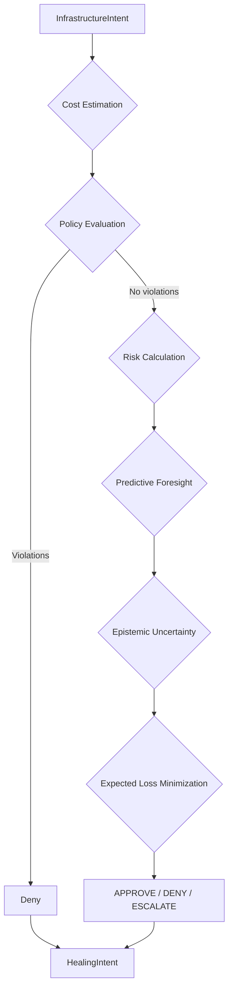

# Governance Loop – Flow & Configuration

This document describes the **step‑by‑step execution** of the ARF Core Engine’s governance loop, the **constants** that control its behaviour, and the **expected loss minimisation** formula.

> **Canonical definitions** of `InfrastructureIntent`, `HealingIntent`, `RiskScore`, and `GovernanceLoop` are in [`core_concepts.md`](core_concepts.md).

---

## 1. Overview

The governance loop processes an `InfrastructureIntent` and returns a `HealingIntent` containing:

- A recommended action (`APPROVE`, `DENY`, or `ESCALATE`)
- A risk score (`RiskScore`) with decomposition
- A detailed justification
- Full metadata for traceability (epistemic uncertainty, business impact, forecasts, etc.)

The loop is **deterministic** for a given input, ensuring reproducibility and auditability.

---

## 2. Step‑by‑Step Execution

```python
def run(intent: InfrastructureIntent, context: dict) -> HealingIntent:
```
## 2. Step‑by‑Step Execution (continued)

### Step 1 – Cost Estimation

`cost_estimator.estimate_monthly_cost(intent)` returns a projected monthly cost (if available).  
Failures are logged but do not block evaluation.

### Step 2 – Policy Evaluation

`policy_evaluator.evaluate(intent, policy_context)` returns a list of policy violations (empty if none).  
**If any violations exist**, the loop immediately sets the recommended action to `DENY` (policy overrides all other factors).

### Step 3 – Risk Calculation

`risk_engine.calculate_risk(intent, cost_estimate, policy_violations)` returns:

- `risk_score` – final Bayesian risk (posterior mean)
- `explanation` – human‑readable justification
- `contributions` – dictionary with per‑component means (`conjugate_mean`, `hyper_mean`, `hmc_prediction`) and their weights

Posterior variance is computed from the Beta parameters for the conjugate component.

### Step 4 – Predictive Foresight (Optional)

If a `SimplePredictiveEngine` is configured, it forecasts service health for the next few time steps.  
A weighted average of risk levels (mapped to numeric values) gives a `predictive_risk` score.

### Step 5 – Business Impact

Using the `BusinessImpactCalculator`, the loop estimates potential revenue loss (`b_mean`) based on current service telemetry.

### Step 6 – Epistemic Uncertainty (Optional)

If `enable_epistemic` is `True`, the loop computes a composite epistemic uncertainty score `psi_mean` as:

psi_mean = 1 - (1 - hallucination_risk) * (1 - forecast_uncertainty) * (1 - data_sparsity)


where:

- `hallucination_risk` comes from an ECLIPSE probe (if provided)
- `forecast_uncertainty` = 1 - mean(confidence) of the forecasts
- `data_sparsity` = exp(-0.05 * len(history)) – decays with more data

### Step 7 – Expected Loss Calculation

For each possible action, the loop computes an expected loss using configurable cost constants:

L_approve = (COST_FP * risk_score +
COST_IMPACT * b_mean +
COST_PREDICTIVE * predictive_risk +
COST_VARIANCE * variance)

L_deny = COST_FN * (1 - risk_score) + COST_OPP * v_mean # v_mean = estimated value (optional)

L_escalate = COST_REVIEW + COST_UNCERTAINTY * psi_mean


### Step 8 – Decision Selection

- If policy violations exist → `DENY`
- Else if `USE_EPISTEMIC_GATE` is `True` **and** `psi_mean > EPISTEMIC_ESCALATION_THRESHOLD` → `ESCALATE`
- Else → action with the **minimum expected loss**

### Step 9 – Semantic Memory Retrieval (Optional)

If a `RAGGraphMemory` is available, the loop retrieves similar past incidents and adds them to the metadata.

### Step 10 – Build the `HealingIntent`

All data (risk factors, expected losses, epistemic breakdown, forecasts, business impact, etc.) are stored in the `metadata` field.  
The `risk_factors` field contains additive contributions from each Bayesian component (conjugate, hyperprior, HMC), using the weights returned by the risk engine.

---

## 3. Governance Loop Flow Diagram



## 4. Configuration Constants

The following constants are defined in the proprietary core engine’s configuration module.  
They control the behaviour of expected loss minimisation and epistemic gating.

| Constant | Description | Default |
|----------|-------------|---------|
| `COST_FP` | Cost of a false positive (approving a risky action) | 10.0 |
| `COST_FN` | Cost of a false negative (denying a safe action) | 5.0 |
| `COST_IMPACT` | Weight for business impact in approve loss | 1.0 |
| `COST_PREDICTIVE` | Weight for predictive risk | 0.5 |
| `COST_VARIANCE` | Weight for posterior variance | 0.3 |
| `COST_OPP` | Opportunity cost weight (used in deny loss) | 2.0 |
| `COST_REVIEW` | Cost of human review (escalate loss) | 15.0 |
| `COST_UNCERTAINTY` | Weight for epistemic uncertainty in escalate loss | 1.0 |
| `EPISTEMIC_ESCALATION_THRESHOLD` | If `psi_mean` > threshold, force escalate | 0.5 |
| `USE_EPISTEMIC_GATE` | Boolean to enable/disable epistemic‑based escalation | `False` |

**Note:** These defaults are advisory. Enterprise customers may override them via configuration.

---

## 5. Example Output (`HealingIntent`)

```json
{
  "action": "ESCALATE",
  "justification": "Risk score 0.38, epistemic uncertainty 0.45, expected losses: approve=18.2, deny=12.7, escalate=11.5",
  "risk_score": 0.38,
  "risk_factors": {
    "conjugate": 0.22,
    "hmc": 0.16
  },
  "metadata": {
    "predictive_risk": 0.25,
    "epistemic_breakdown": {
      "hallucination": 0.1,
      "forecast_uncertainty": 0.3,
      "data_sparsity": 0.2
    },
    "decision_trace": {
      "expected_losses": { "APPROVE": 18.2, "DENY": 12.7, "ESCALATE": 11.5 },
      "selected_action": "ESCALATE"
    }
  }
}
```

## 6. Related Code (Proprietary)

The governance loop is implemented in the proprietary core engine at:  
`agentic_reliability_framework/core/governance/governance_loop.py`  

Configuration constants are defined in:  
`agentic_reliability_framework/core/config/constants.py`  

These files are **not public**, but the behaviour described here matches their implementation.

---

## 7. See Also

- [`core_concepts.md`](core_concepts.md) – canonical definitions of intents, risk score, and execution ladder
- [`mathematics.md`](mathematics.md) – Bayesian risk scoring formulas
- [`design.md`](design.md) – architectural decisions and trade‑offs
