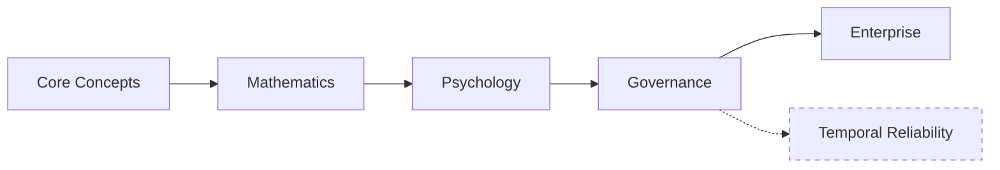

# ARF Specification

  <h1 style="margin: 0; font-size: 2.5rem;">Agentic Reliability Framework</h1>
  
Provably safe, mathematically grounded governance for AI‑powered infrastructure.

  

    <a href="https://github.com/arf-foundation/agentic_reliability_framework" style="background: white; color: #667eea; padding: 0.5rem 1rem; border-radius: 6px; text-decoration: none; font-weight: bold; margin: 0 0.5rem;">GitHub</a>
    <a href="https://huggingface.co/spaces/A-R-F/Agentic-Reliability-Framework-v4" style="background: white; color: #667eea; padding: 0.5rem 1rem; border-radius: 6px; text-decoration: none; font-weight: bold; margin: 0 0.5rem;">Live Demo</a>
  

## The Framework at a Glance

ARF is organized as a **layered specification**, each building on the one before:

Core Concepts – reliability, observability, and traceability for AI agents.

Mathematics – Bayesian risk scoring, HMC, and expected loss minimisation.

Psychology – trust calibration, human‑in‑the‑loop design, and explainability.

Governance – policy evaluation, cost estimation, and the full governance loop.

Enterprise – execution ladder, audit trails, and deployment architectures.

Temporal Reliability – optional extension for time‑series anomaly detection and forecasting.

---

## Why ARF?

| Challenge | ARF Solution |
|-----------|---------------|
| **Risky AI actions** | Bayesian risk scoring with dynamic fusion of online and offline models |
| **Brittle policy rules** | Expected loss minimisation that balances risk, cost, and uncertainty to select the optimal action (approve, deny, or escalate). |
| **Lack of auditability** | Full traceability in every decision, with optional enterprise audit trails |
| **Complex decision context** | Governance loop integrates cost, policy, risk, epistemic uncertainty, and memory |
| **Scaling from prototype to production** | Clear boundaries between core engine (proprietary) and enterprise enforcement |

---

## Specification Sections

- [Roadmap](roadmap.md) – future direction and milestones
- [Design](design.md) – architectural decisions and trade‑offs
- [Mathematics](mathematics.md) – the Bayesian engine behind risk scoring
- [Psychology](psychology.md) – building trust through transparency
- [Governance](governance.md) – the decision‑making loop in action
- [Enterprise](enterprise.md) – scaling to production with enforcement and audit
- [Temporal Reliability](temporal_reliability.md) – optional time‑series extensions

---

## Boundary Note

Temporal reliability is intentionally defined as a separate specification layer.

It must remain:
- optional
- external to in‑session scoring
- outside the core ARF execution path
- suitable for implementation in enterprise or extension layers

This keeps the core deterministic, session‑scoped, and easy to audit.

---

## Public vs. Proprietary

| Component | Status |
|-----------|--------|
| This specification (`arf-spec`) | ✅ Public (Apache 2.0) |
| Core engine (advisory logic) | 🔒 Proprietary – pilot access only |
| Enterprise enforcement layer | 🔒 Proprietary – outcome‑based pricing |
| Public demo UI (`arf-frontend`) | ✅ Public (Apache 2.0) |

The core engine is **not open source**. It is access‑controlled and available under outcome‑based pricing to qualified pilots and enterprise customers.
