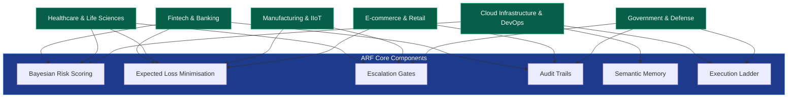

# Industry Use Cases

This page shows how the Agentic Reliability Framework (ARF) delivers concrete benefits across different industries. The diagram below maps the core ARF components to the sectors where they create the most value.

## How ARF Supports Different Industries

1\. Fintech & Banking
---------------------

### The Challenge

AI agents that approve payments, detect fraud, or execute trades must never make a mistake – a single error can cost millions and violate strict regulations like PCI‑DSS and SOX.

### What ARF Does for You

ARF acts as a **digital safety officer** that examines every AI decision before it happens. It calculates the risk of an error, weighs the cost of being wrong, and creates an immutable record for auditors.

### Key Benefits

*   **Prevent costly errors** – automatically block or escalate high‑risk transactions.
    
*   **Meet compliance effortlessly** – every decision is signed and timestamped for regulators.
    
*   **Balance speed and safety** – low‑risk actions proceed autonomously; high‑risk ones require human approval.
    

### Example in Action

A payment agent wants to approve a $500,000 international transfer. ARF checks historical failure rates for similar transfers, applies your bank’s policy (“no large transfers after 6 PM”), and either:

*   **Approves** if risk is low and policy allows,
    
*   **Denies** if policy forbids it, or
    
*   **Escalates** to a human operator for review.
    

### How It Works (Simplified)

*   **Bayesian risk scoring** – learns from past successful and failed payments.
    
*   **Expected loss minimisation** – compares the cost of blocking a good payment versus allowing a fraudulent one.
    
*   **Audit trails** – records every decision in a tamper‑proof log.
    

2\. Healthcare & Life Sciences
------------------------------

### The Challenge

AI agents that access patient records, suggest treatments, or configure medical devices must be absolutely safe and comply with HIPAA, FDA, and clinical standards.

### What ARF Does for You

ARF provides a **safety net for clinical AI** – it knows when the AI is uncertain and automatically calls for a human expert. It also guarantees that any change can be undone.

### Key Benefits

*   **Protect patient safety** – escalate uncertain decisions to clinicians.
    
*   **Ensure compliance** – every access and action is auditable.
    
*   **Enable reversible actions** – always verify that a change can be rolled back.
    

### Example in Action

A nurse’s AI assistant requests access to a patient’s full history. ARF checks the role, time of day, and recent access patterns. If it detects an unusual pattern (e.g., night shift, new patient), it escalates to a supervisor for approval.

### How It Works (Simplified)

*   **Epistemic uncertainty** – measures how confident the AI is; if confidence is low, a human steps in.
    
*   **Rollback feasibility** – confirms that any configuration change (e.g., ventilator settings) can be undone.
    
*   **Causal explanations** – answers “What would happen if we chose a different treatment?”
    

3\. Cloud Infrastructure & DevOps
---------------------------------

### The Challenge

AI agents that automatically scale servers, restart services, or provision resources can cause costly outages if they misbehave.

### What ARF Does for You

ARF acts as a **reliability copilot** – it remembers past incidents, estimates costs, and lets low‑risk actions run autonomously while requiring approval for dangerous ones.

### Key Benefits

*   **Prevent outages** – block risky changes based on historical data.
    
*   **Control cloud costs** – estimate monthly cost before provisioning.
    
*   **Speed up operations** – low‑risk restarts and scaling happen automatically.
    

### Example in Action

A DevOps agent wants to scale out a database during peak hours. ARF checks similar past scaling events, your policy (“no scaling after 8 PM”), and the estimated monthly cost. If all checks pass, it approves automatically. If not, it denies or escalates.

### How It Works (Simplified)

*   **Conjugate Beta priors** – learns failure rates for each resource type (database, network, compute).
    
*   **Semantic memory** – retrieves similar past incidents to boost confidence.
    
*   **Execution ladder** – allows autonomous actions for low risk, but requires approval for high risk (e.g., dropping a production database).
    

4\. Manufacturing & Industrial IoT
----------------------------------

### The Challenge

AI agents controlling robotic arms, assembly lines, or predictive maintenance must be fail‑safe – a wrong move can cause physical damage or halt production.

### What ARF Does for You

ARF provides a **mechanical safety guard** that blocks any action that could be harmful. It verifies that changes can be undone and ensures the system returns to a safe state.

### Key Benefits

*   **Prevent physical damage** – block actions that exceed risk tolerances.
    
*   **Guarantee reversibility** – every change must have a rollback plan.
    
*   **Maintain safe operation** – Lyapunov stability ensures actions drive the system toward safety.
    

### Example in Action

A robot calibration agent proposes adjusting a conveyor belt speed. ARF checks the risk score (must be <0.05), verifies that a snapshot of current settings exists (rollback feasible), and estimates the causal effect of the change. Only if all gates pass does the robot execute.

### How It Works (Simplified)

*   **Risk gates** – set a very low risk tolerance for physical actions.
    
*   **Rollback gates** – require a confirmed backup before any change.
    
*   **Causal gates** – block actions predicted to increase safety risk.
    
*   **Lyapunov stability** – mathematically guarantees that healing actions lead to stable, safe operation.
    

5\. E‑commerce & Retail
-----------------------

### The Challenge

AI agents personalising offers, managing inventory, or handling returns must avoid losing revenue or damaging customer trust.

### What ARF Does for You

ARF acts as a **profit protector** – it weighs the cost of a bad decision against the missed opportunity, and can track long‑term reliability of recommendation agents.

### Key Benefits

*   **Maximise revenue** – approve promotions that are likely profitable, deny risky ones.
    
*   **Protect brand trust** – escalate uncertain personalisation to human review.
    
*   **Monitor reliability over time** – optional temporal tracking of AI agent performance.
    

### Example in Action

A recommendation agent wants to give a 30% discount code to a new customer segment. ARF calculates the expected loss: approving a bad discount could hurt margins, denying a good one could lose a sale. If uncertainty is high, it escalates to a marketing manager.

### How It Works (Simplified)

*   **Expected loss minimisation** – uses cost constants to balance false positives (bad discount) and false negatives (missed sale).
    
*   **Business impact calculator** – estimates revenue loss from downtime or poor decisions.
    
*   **Temporal reliability** – optional cross‑session tracking to detect degrading performance.
    

6\. Government & Defense
------------------------

### The Challenge

AI agents handling classified data, surveillance, or logistics must be unbreakably secure and fully accountable.

### What ARF Does for You

ARF provides **zero‑trust AI governance** – every action is cryptographically signed, audited, and requires appropriate approvals. No action can be taken without passing strict checks.

### Key Benefits

*   **Unforgeable accountability** – signed intents prove authenticity.
    
*   **Complete auditability** – every gate decision is logged in a write‑once database.
    
*   **Forced human approval** – sensitive actions (e.g., changing access controls) require administrative sign‑off.
    

### Example in Action

A logistics agent requests a new server in a classified environment. ARF checks the license, requires an admin approval gate, and verifies the action is not on the disallowed list (e.g., “DATABASE\_DROP”). If any gate fails, the action is denied.

### How It Works (Simplified)

*   **Cryptographic signing** – each HealingIntent is digitally signed; the enterprise layer verifies the signature.
    
*   **Immutable audit trails** – all gate results, approvals, and overrides are stored in an append‑only log.
    
*   **Execution ladder** – forces human‑in‑the‑loop for any action that changes security controls.
    

How to Contribute
-----------------

If you have a use case for an industry not listed here, please open an issue or pull request on the [arf-spec GitHub repository](https://github.com/arf-foundation/arf-spec). We welcome community contributions to expand this section.

See Also
--------

*   [core\_concepts.md](https://core_concepts.md/) – definitions of core entities
    
*   [governance.md](https://governance.md/) – detailed decision flow
    
*   [enterprise.md](https://enterprise.md/) – enforcement and audit capabilities
    
*   [mathematics.md](https://mathematics.md/) – Bayesian and stability mathematics
